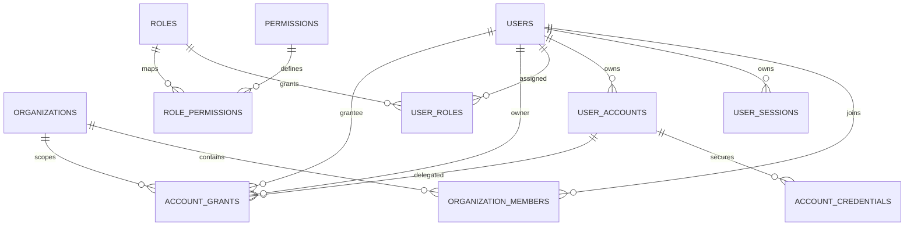
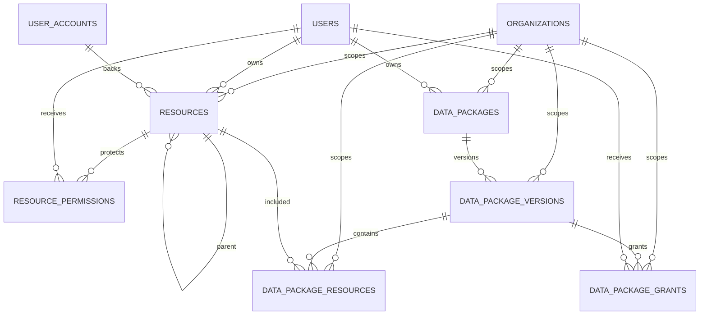
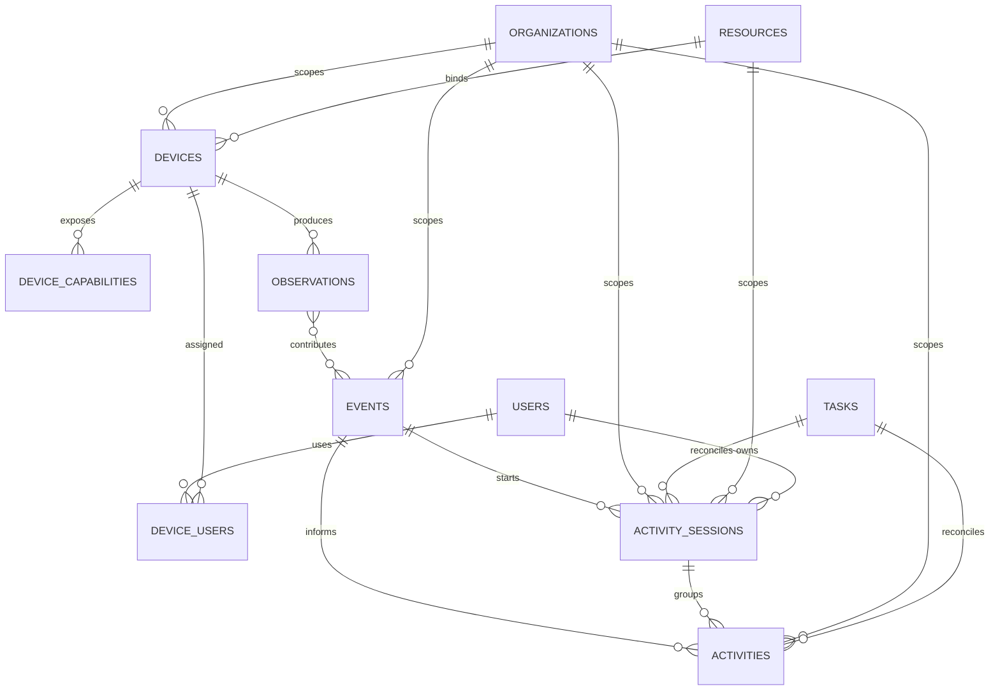
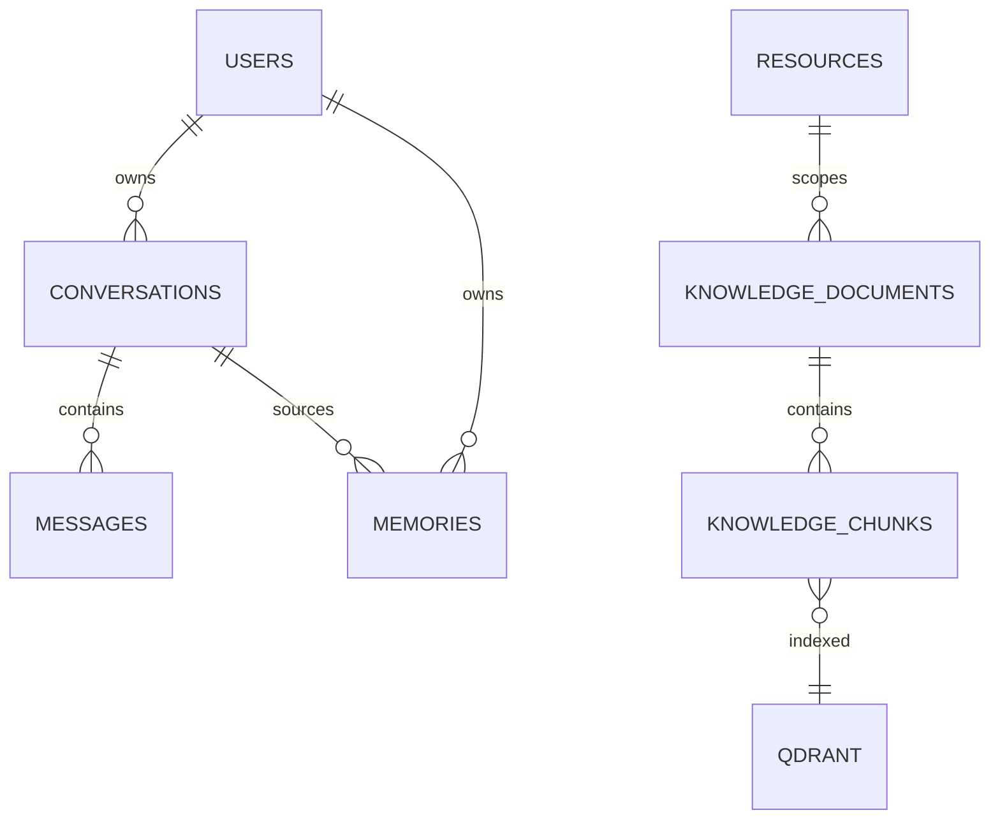
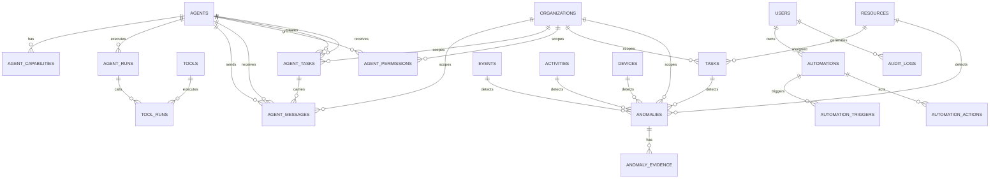

# Workspace AI Agent — ERD V2.1

> ERD logic cấp architecture. Schema chi tiết nằm trong `DATABASE_V2_DETAILED.md`.

## 1. Tenant / Identity / Authorization



**Quan trọng:** `organization_members.member_role` không thay thế `roles/permissions/role_permissions`.

## 2. Resource / Package



Tenant invariants:
- `account_grants` thuộc một `organization_id`; owner và grantee phải là member của organization.
- Data Package, version, package-resource và package-grant đều mang `organization_id`.
- Package chỉ được chứa resource cùng organization.
- `parent_resource_id` phải cùng `organization_id`.
- `resources.organization_id` và `devices.organization_id` là bắt buộc.

## 3. Device / Event / Activity



Observation là raw observation; Event là meaningful event; Activity Session là lifecycle; Activity là recorded domain activity.

## 4. Conversation / Memory / Knowledge



SQL là source of truth cho ownership/access metadata; Qdrant là vector retrieval store.

## 5. Agents / Tools / Automation / Audit



Agent-to-Agent message/task không tự cấp quyền; execution vẫn qua Application Authorization.

## 6. Authorization execution path

```text
Request
 ↓
Authentication
 ↓
Organization Context
 ↓
Capability
 ↓
Account Resolver (candidate only)
 ↓
Authorization
 ├─ Membership / tenant eligibility
 ├─ Capability permission
 ├─ Account access
 ├─ Resource access
 └─ Package access (if applicable)
 ↓
Credential Resolver
 ↓
Tool
 ↓
Provider
 ↓
Audit / Run Trace
```

Nếu Authorization = DENY:

```text
Credential Resolver = NOT CALLED
Tool = NOT CALLED
Provider API = NOT CALLED
```


## 7. V2.1 integrity rules

- Organization-scoped entities cannot reference resources/devices/tasks/agents from another organization.
- Account grants cannot cross organization membership boundaries.
- Data Packages cannot contain or grant access to resources/users outside their organization.
- `parent_resource_id` must remain inside the same organization as `resources.organization_id`.
- Device/resource binding must remain inside the same organization.
- Agent-to-Agent delegation is same-organization only in V2.1.
- Anomaly evidence must resolve to a source entity in the same organization as the anomaly.
- Agent message/task is transport/work state; it never grants authorization by itself.
